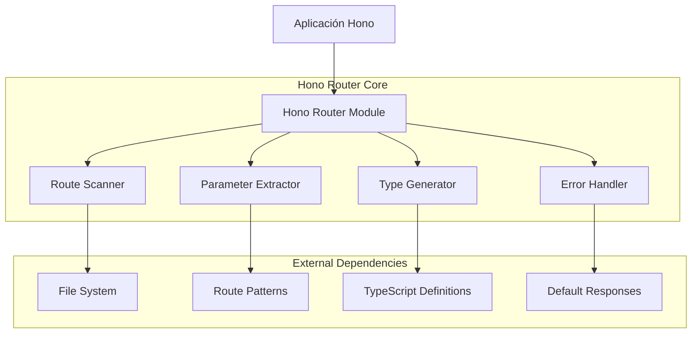
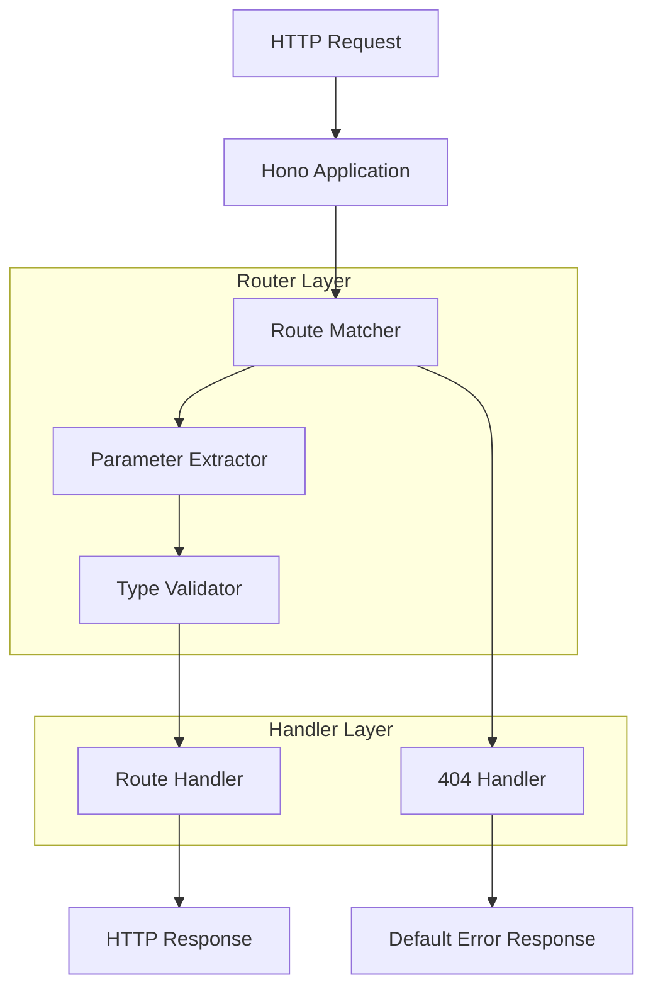
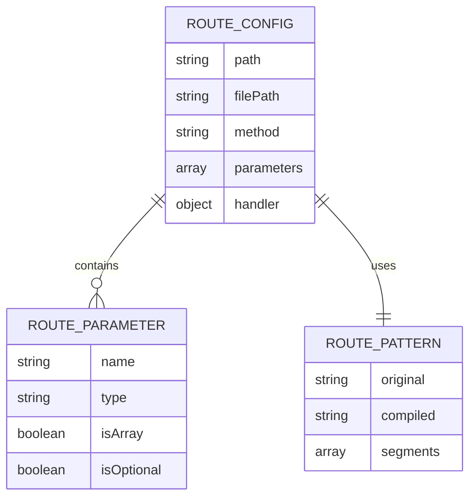

# Documento de Arquitectura Técnica - Hono Router

## 1. Diseño de Arquitectura



## 2. Descripción de Tecnologías

* **Frontend**: No aplica (módulo backend)

* **Backend**: TypeScript + Hono Framework

* **Dependencias principales**:

  * `@hono/hono` (framework base)

  * `typescript` (tipado estático)

  * `fs/promises` (análisis de sistema de archivos)

  * `path` (manipulación de rutas)

## 3. Definiciones de Rutas

| Ruta                          | Propósito                       |
| ----------------------------- | ------------------------------- |
| `/api/users`                  | Ruta simple sin parámetros      |
| `/api/users/[id]`             | Ruta con parámetro único `id`   |
| `/api/blog/[slug]`            | Ruta con parámetro único `slug` |
| `/api/products/[...segments]` | Ruta con segmentos variables    |
| `/api/users/[id]/update`      | Ruta anidada con parámetro      |

## 4. Definiciones de API

### 4.1 API Principal

**Inicialización del Router**

```typescript
function createHonoRouter(options?: RouterOptions): HonoRouter
```

Parámetros:

| Nombre del Parámetro | Tipo del Parámetro | Es Requerido | Descripción                                     |
| -------------------- | ------------------ | ------------ | ----------------------------------------------- |
| options              | RouterOptions      | false        | Configuración opcional del router               |
| options.routesDir    | string             | false        | Directorio de rutas (por defecto: 'src/routes') |
| options.baseUrl      | string             | false        | URL base para las rutas                         |

Respuesta:

| Nombre del Parámetro | Tipo del Parámetro | Descripción                      |
| -------------------- | ------------------ | -------------------------------- |
| router               | HonoRouter         | Instancia del router configurado |

**Registro de Rutas**

```typescript
function registerRoutes(app: Hono): Promise<void>
```

Parámetros:

| Nombre del Parámetro | Tipo del Parámetro | Es Requerido | Descripción                     |
| -------------------- | ------------------ | ------------ | ------------------------------- |
| app                  | Hono               | true         | Instancia de la aplicación Hono |

**Handler de Ruta**

```typescript
type RouteHandler<T = any> = (context: Context, params: T) => Promise<Response> | Response
```

Ejemplo de uso:

```typescript
// src/routes/api/users/[id].ts
export const handler: RouteHandler<{ id: string }> = async (c, params) => {
  return c.json({ userId: params.id })
}
```

## 5. Diagrama de Arquitectura del Servidor



## 6. Modelo de Datos

### 6.1 Definición del Modelo de Datos



### 6.2 Lenguaje de Definición de Datos

**Interfaces TypeScript**

```typescript
// Configuración de ruta
interface RouteConfig {
  path: string;
  filePath: string;
  method: HttpMethod;
  parameters: RouteParameter[];
  handler: RouteHandler;
}

// Parámetro de ruta
interface RouteParameter {
  name: string;
  type: 'single' | 'spread';
  isArray: boolean;
  isOptional: boolean;
}

// Patrón de ruta
interface RoutePattern {
  original: string;
  compiled: RegExp;
  segments: RouteSegment[];
}

// Segmento de ruta
interface RouteSegment {
  type: 'static' | 'parameter' | 'spread';
  value: string;
  parameterName?: string;
}

// Opciones del router
interface RouterOptions {
  routesDir?: string;
  baseUrl?: string;
  caseSensitive?: boolean;
  strictSlash?: boolean;
}

// Contexto extendido con parámetros tipados
interface ExtendedContext<T = any> extends Context {
  params: T;
}

// Tipos de métodos HTTP soportados
type HttpMethod = 'GET' | 'POST' | 'PUT' | 'DELETE' | 'PATCH' | 'OPTIONS' | 'HEAD';

// Handler de ruta tipado
type RouteHandler<T = any> = (
  context: ExtendedContext<T>
) => Promise<Response> | Response;
```

**Estructura de Archivos del Módulo**

```
hono-router/
├── src/
│   ├── index.ts              # Exportaciones principales
│   ├── router.ts             # Lógica principal del router
│   ├── scanner.ts            # Escáner de archivos de rutas
│   ├── parameter-extractor.ts # Extractor de parámetros
│   ├── type-generator.ts     # Generador de tipos
│   └── error-handler.ts      # Manejador de errores
├── types/
│   ├── index.ts              # Exportaciones de tipos
│   ├── router.ts             # Tipos del router
│   ├── route.ts              # Tipos de rutas
│   └── handler.ts            # Tipos de handlers
├── tests/
│   ├── router.test.ts        # Pruebas del router
│   ├── scanner.test.ts       # Pruebas del escáner
│   ├── parameter.test.ts     # Pruebas de parámetros
│   └── fixtures/             # Archivos de prueba
└── package.json              # Configuración del paquete
```

**Configuración del package.json**

```json
{
  "name": "hono-router",
  "version": "1.0.0",
  "description": "Dynamic file-based routing for Hono framework",
  "main": "dist/index.js",
  "types": "dist/index.d.ts",
  "scripts": {
    "build": "tsc",
    "test": "jest",
    "dev": "tsc --watch"
  },
  "peerDependencies": {
    "hono": "^3.0.0"
  },
  "devDependencies": {
    "@types/node": "^20.0.0",
    "typescript": "^5.0.0",
    "jest": "^29.0.0",
    "@types/jest": "^29.0.0"
  },
  "files": [
    "dist",
    "types"
  ],
  "keywords": [
    "hono",
    "router",
    "file-based",
    "typescript",
    "dynamic-routing"
  ]
}
```

