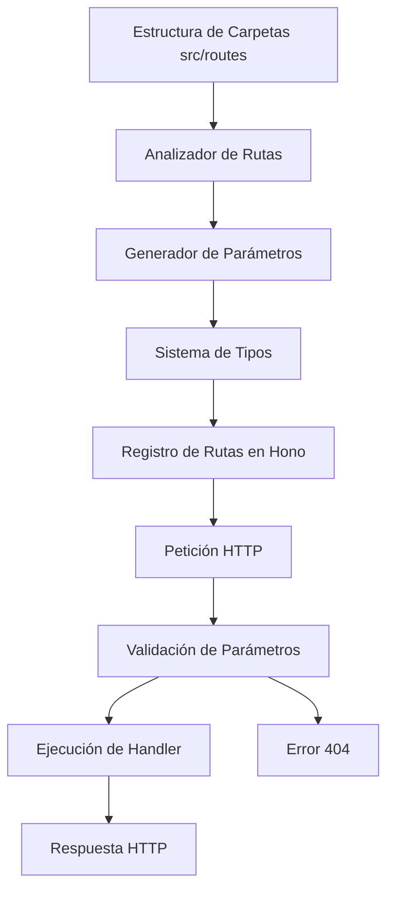

# Documento de Requerimientos del Producto - Hono Router

## 1. Descripción General del Producto

Hono Router es un módulo especializado para el framework Hono que automatiza la gestión de rutas dinámicas basándose en la estructura de carpetas del proyecto. El módulo analiza automáticamente la estructura de directorios en `src/routes` y genera rutas HTTP correspondientes con soporte completo para parámetros dinámicos, validación y tipado TypeScript.

El producto resuelve la necesidad de configuración manual de rutas en aplicaciones Hono, proporcionando un sistema de enrutamiento basado en convenciones que mejora la productividad del desarrollador y reduce errores de configuración.

## 2. Características Principales

### 2.1 Roles de Usuario

| Rol | Método de Registro | Permisos Principales |
|-----|-------------------|---------------------|
| Desarrollador | Instalación del módulo npm | Puede configurar rutas, definir handlers, acceder a tipos TypeScript |
| Usuario Final | Acceso HTTP a las rutas | Puede realizar peticiones HTTP a las rutas generadas automáticamente |

### 2.2 Módulos de Funcionalidad

Nuestro módulo hono-router consta de las siguientes páginas principales:

1. **Analizador de Rutas**: escaneo automático de carpetas, detección de patrones de rutas, generación de mapeo de rutas.
2. **Generador de Parámetros**: extracción de parámetros únicos, manejo de segmentos variables, validación de parámetros.
3. **Sistema de Tipos**: definiciones TypeScript, inferencia de tipos de parámetros, tipado de handlers.
4. **Manejador de Errores**: respuestas por defecto, manejo de rutas no encontradas, validación de entrada.

### 2.3 Detalles de Páginas

| Nombre de Página | Nombre del Módulo | Descripción de Funcionalidad |
|------------------|-------------------|------------------------------|
| Analizador de Rutas | Escáner de Carpetas | Escanea recursivamente `src/routes`, detecta archivos de ruta, mapea estructura a patrones URL |
| Analizador de Rutas | Detector de Patrones | Identifica rutas simples (`/api/users`), parámetros únicos (`[id]`), segmentos variables (`[...name]`) |
| Generador de Parámetros | Extractor de Parámetros | Transforma `/api/users/[id]` a `{ id: 'valor' }`, maneja múltiples parámetros en ruta |
| Generador de Parámetros | Procesador de Segmentos | Convierte `/api/products/[...items]` a `{ items: ['a', 'b', 'c'] }` |
| Sistema de Tipos | Generador de Tipos | Crea interfaces TypeScript para parámetros de cada ruta automáticamente |
| Sistema de Tipos | Validador de Tipos | Valida tipos de parámetros en tiempo de ejecución |
| Manejador de Errores | Respuesta por Defecto | Genera respuesta 404 personalizable para rutas no encontradas |
| Manejador de Errores | Validador de Entrada | Valida formato y tipo de parámetros de entrada |

## 3. Proceso Principal

**Flujo del Desarrollador:**
1. El desarrollador instala el módulo hono-router
2. Crea estructura de carpetas en `src/routes` con archivos de ruta
3. Cada archivo exporta una función `handler` con callback
4. El módulo escanea automáticamente la estructura
5. Genera rutas dinámicas con tipado TypeScript
6. Las rutas están disponibles para peticiones HTTP

**Flujo del Usuario Final:**
1. Realiza petición HTTP a una ruta generada
2. El router analiza la URL y extrae parámetros
3. Valida los parámetros según el tipo de ruta
4. Ejecuta el handler correspondiente con contexto Hono
5. Retorna respuesta o error 404 si no existe

## 4. Diseño de Interfaz de Usuario

### 4.1 Estilo de Diseño

- **Colores primarios y secundarios**: No aplica (módulo backend)
- **Estilo de botones**: No aplica (módulo backend)
- **Fuente y tamaños preferidos**: Código TypeScript con fuentes monoespaciadas
- **Estilo de layout**: Estructura modular basada en carpetas
- **Sugerencias de emojis o iconos**: 📁 para carpetas, 🔗 para rutas, ⚡ para Hono

### 4.2 Resumen de Diseño de Páginas

| Nombre de Página | Nombre del Módulo | Elementos de UI |
|------------------|-------------------|----------------|
| Analizador de Rutas | Escáner de Carpetas | Interfaz programática, logs de consola para debugging, estructura de árbol de rutas |
| Generador de Parámetros | Extractor de Parámetros | Objetos JavaScript con parámetros tipados, validación automática |
| Sistema de Tipos | Generador de Tipos | Definiciones TypeScript auto-generadas, IntelliSense mejorado |
| Manejador de Errores | Respuesta por Defecto | Respuestas JSON estructuradas, códigos de estado HTTP apropiados |

### 4.3 Responsividad

No aplica - este es un módulo backend que no tiene interfaz visual. La "responsividad" se refiere a la capacidad del módulo de adaptarse a diferentes estructuras de carpetas y patrones de rutas de manera flexible.